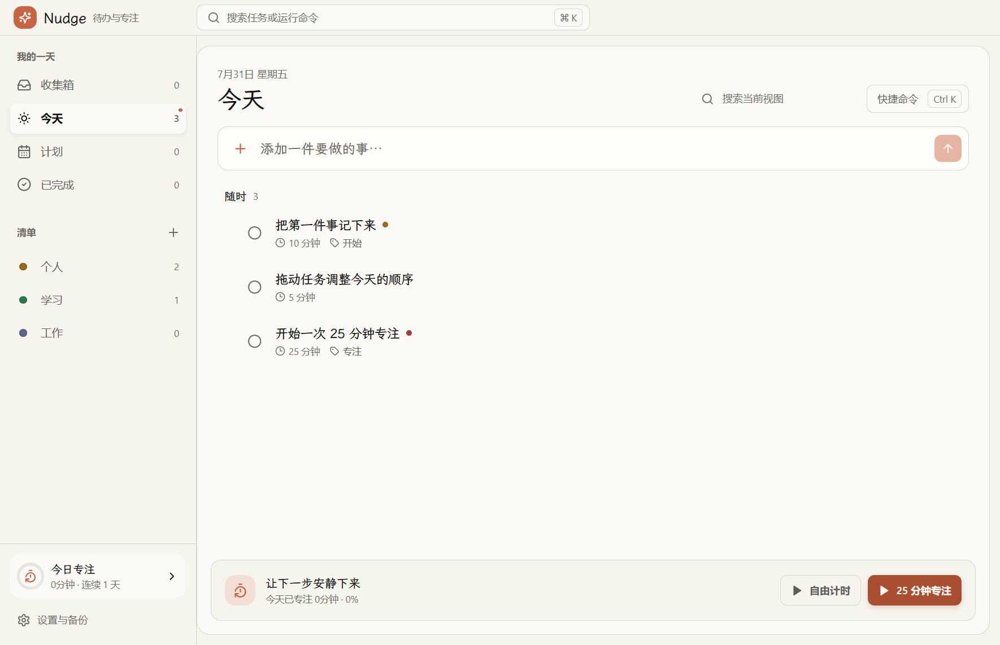
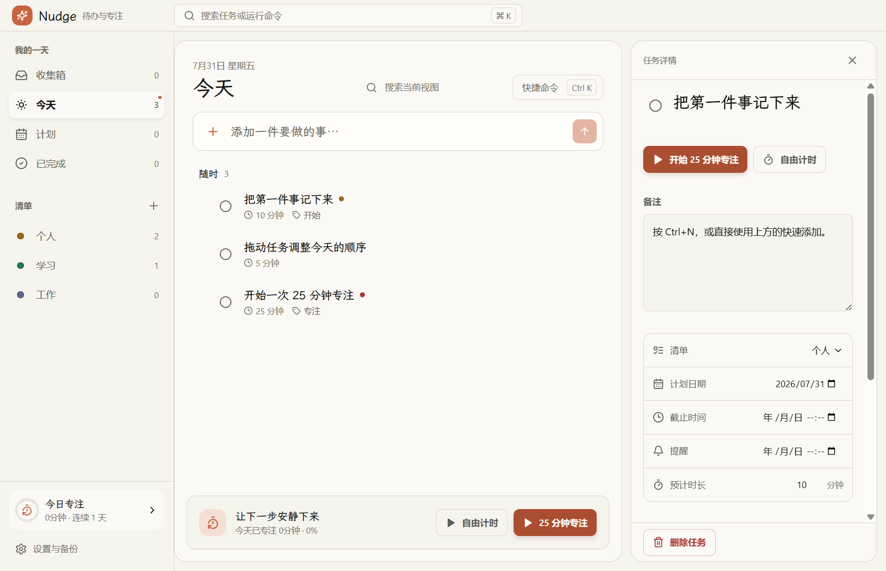
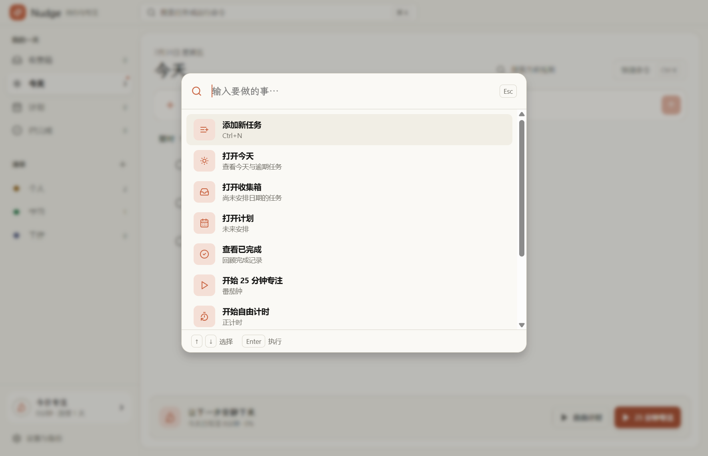
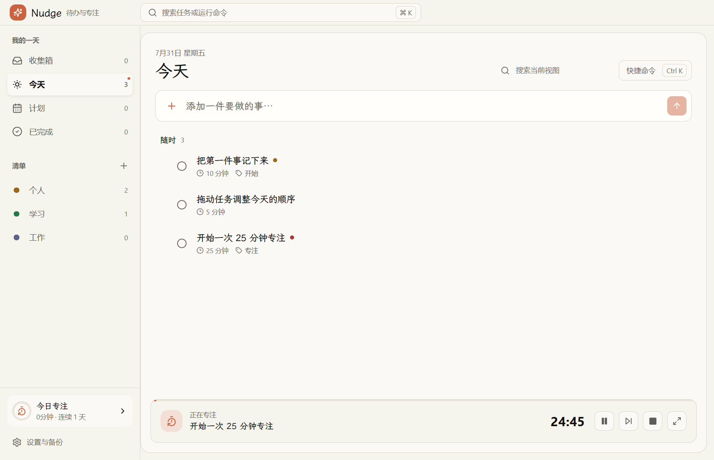
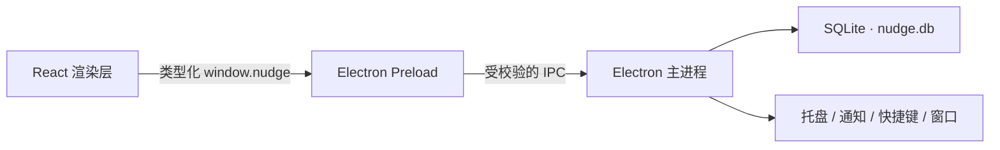

<p align="center">
  
</p>

<h1 align="center">Nudge</h1>

<p align="center">
  一款离线优先、强调即时反馈的 Windows 桌面待办与专注工具。
</p>

<p align="center">
  <a href="https://github.com/Kirtofu/study-nudge/releases/latest"></a>
  
  
  
</p>



Nudge 把任务捕获、今天安排、番茄专注、提醒和本地备份放进一个安静的桌面工作区。它没有账号、云服务和协作层，所有数据默认保存在当前电脑上。

## 下载

当前版本：**v1.0.0 · Windows x64**

| 版本 | 适合场景 | 下载 | SHA-256 |
| --- | --- | --- | --- |
| 安装版 | 标准安装，可选择安装目录并创建桌面/开始菜单快捷方式 | [Nudge-Setup-1.0.0-x64.exe](https://github.com/Kirtofu/study-nudge/releases/download/v1.0.0/Nudge-Setup-1.0.0-x64.exe) | `83A14479CC696AE79E4F3C84965773387B55EF112B218F85C0D636D715608107` |
| 便携版 | 无需安装，适合 U 盘或临时使用 | [Nudge-Portable-1.0.0-x64.exe](https://github.com/Kirtofu/study-nudge/releases/download/v1.0.0/Nudge-Portable-1.0.0-x64.exe) | `01DE4F444F54272663891B09ECBAB64D6D5D3F4D0B0F137915A03F1997784A2D` |

也可以在 [Releases](https://github.com/Kirtofu/study-nudge/releases) 查看全部发布文件，或从仓库的 [`packages/`](./packages/) 目录获取通过 Git LFS 保存的软件包。

> [!IMPORTANT]
> 当前安装包尚未购买代码签名证书。Windows SmartScreen 可能显示“Windows 已保护你的电脑”。请只从本仓库 Release 下载，并在运行前核对上方 SHA-256；确认无误后可选择“更多信息 → 仍要运行”。

## 核心能力

### 待办管理

- 收集箱、今天、计划、已完成与自定义清单。
- 行内快速添加，支持 `#标签`、`!高`、`!中`、`!低` 快速语法。
- 任务详情抽屉，可编辑备注、清单、计划日期、截止时间、提醒、优先级与预计时长。
- 子任务、标签、搜索、拖拽排序和悬停快捷操作。
- 完成任务后即时收拢，并提供 5 秒撤销入口。

### 专注计时

- 25 分钟番茄钟与自由正计时。
- 可将专注记录关联到具体任务。
- 暂停、继续、跳过、停止与进度显示。
- 今日目标、长期目标、连续专注天数和历史记录。
- 使用时间戳恢复状态，可处理休眠、唤醒和应用异常退出后的计时偏差。
- 可切换为置顶专注迷你窗，减少工作时的视觉干扰。

### Windows 桌面能力

- 系统托盘与双击唤回主窗口。
- 关闭窗口默认进入托盘；显式退出后停止提醒。
- 原生任务提醒通知。
- 可选开机启动。
- 可配置全局快速添加快捷键，默认 `Ctrl+Alt+Space`。
- 安装程序、任务栏、托盘和窗口均使用 Nudge 自有图标。

### 本地数据与备份

- SQLite 持久化，渲染层不直接访问数据库或文件系统。
- 所有 IPC 输入通过 Zod 校验，并通过类型化 `window.nudge` 接口暴露给 React。
- 每日自动创建数据库备份，保留最近 7 份。
- 支持 JSON 导出、合并导入与整库恢复。
- 启动时扫描旧版 `data.json`，按来源哈希去重导入历史专注记录。
- 原有 `study-nudge.ps1` 和 `data.json` 保持不变，脚本后续新增的记录也会在应用启动时继续同步导入。

## 强交互体验

Nudge 的“强交互感”来自清晰的状态变化，而不是装饰性特效：

- 悬停任务时显示拖动柄与快捷操作。
- 按钮按下会轻微缩放并压深颜色，操作结果立即反馈。
- 拖拽时任务抬升，并显示明确插入位置。
- 任务完成时依次执行勾选描边、文字划除、赭橙墨点和列表收拢。
- 详情抽屉、清单切换和命令面板使用 150–300ms 的方向性动效。
- 所有主要控件包含默认、悬停、焦点、按下、禁用或加载状态。
- 支持可见键盘焦点和系统“减少动画”设置。

## 界面一览

<table>
  <tr>
    <td width="50%">
      
      <p align="center"><strong>任务详情</strong><br>编辑任务属性，并直接启动关联专注。</p>
    </td>
    <td width="50%">
      
      <p align="center"><strong>快捷命令</strong><br>用键盘快速切换视图、添加任务和启动计时。</p>
    </td>
  </tr>
  <tr>
    <td width="50%">
      
      <p align="center"><strong>任务专注</strong><br>计时状态、关联任务与控制操作保持在底部可见。</p>
    </td>
    <td width="50%">
      
      <p align="center"><strong>今日时间线</strong><br>左侧导航、中央任务区和底部专注入口。</p>
    </td>
  </tr>
</table>

## 「赭墨纸感 UI」

Nudge 的设计体系命名为 **赭墨纸感 UI（Ochre Ink Paper UI）**，视觉参考 [invite.ioll.pp.ua](https://invite.ioll.pp.ua/)：

- 背景 `#f5f4ed`
- 表面 `#faf9f5`
- 主文字 `#141413`
- 次级文字 `#5e5d59`
- 赭橙强调色 `#c96442`
- 品牌、标题和任务内容使用霞鹜文楷；日期、表单和快捷键信息使用 Segoe UI Variable
- 12–16px 圆角、克制阴影和紧凑信息层级

完整原则见 [`DESIGN.md`](./DESIGN.md)，产品定位与边界见 [`PRODUCT.md`](./PRODUCT.md)。

## 快捷键

| 快捷键 | 作用 |
| --- | --- |
| `Ctrl+N` | 聚焦快速添加并新建任务 |
| `Ctrl+K` | 打开快捷命令面板 |
| `Ctrl+F` | 聚焦当前视图搜索 |
| `Ctrl+Alt+Space` | 从系统任意位置唤起全局快速添加，可在设置中修改 |
| `↑` / `↓` | 在快捷命令结果间移动 |
| `Enter` | 执行选中的命令或提交任务 |
| `Esc` | 关闭命令面板或当前浮层 |

## 数据位置与隐私

Nudge 不要求登录，不发送任务、专注记录或设置到远程服务。

| 数据 | 默认位置 |
| --- | --- |
| SQLite 主数据库 | `%APPDATA%\Nudge\nudge.db` |
| 自动数据库备份 | `%APPDATA%\Nudge\backups\` |
| 旧数据来源 | 项目目录、程序目录或资源目录中的 `data.json` |

整库恢复会先自动备份当前数据库。合并导入会保留现有数据，并避免重复写入相同来源的历史专注记录。

## 技术架构



- Electron 43
- React 19 + TypeScript 5
- Vite / electron-vite
- SQLite（Electron 内置 `node:sqlite`）
- Zustand 状态管理
- Motion 动效
- dnd-kit 拖拽排序
- Zod IPC 输入验证
- Vitest + Testing Library
- electron-builder / NSIS

## 本地开发

### 环境要求

- Windows 10 或 Windows 11
- Node.js 22 LTS（推荐）
- npm 10+
- Git LFS（仅在需要拉取或提交 `packages/*.exe` 时需要）

### 安装与启动

```powershell
git clone https://github.com/Kirtofu/study-nudge.git
Set-Location study-nudge
git lfs pull
npm install
npm run dev
```

### 检查与测试

```powershell
npm run typecheck
npm test
npm run build
```

### 构建 Windows 软件包

```powershell
npm run build:win
```

默认产物位于 `release/`：

- `Nudge-Setup-1.0.0-x64.exe`：NSIS 安装版
- `Nudge-Portable-1.0.0-x64.exe`：便携版
- `win-unpacked/`：免打包调试目录

## 项目结构

```text
study-nudge/
├─ build/                    # 图标与构建资源
├─ docs/screenshots/         # README 软件截图
├─ packages/                 # Git LFS 发布软件包
├─ src/
│  ├─ main/                  # 窗口、SQLite、托盘、提醒、备份和计时服务
│  ├─ preload/               # 安全、类型化的 window.nudge 桥接层
│  ├─ renderer/              # React 界面、状态管理和交互组件
│  └─ shared/                # 主进程与渲染层共享类型
├─ DESIGN.md                 # 赭墨纸感 UI 设计系统
├─ PRODUCT.md                # 产品定位、用户与设计原则
├─ study-nudge.ps1           # 保留的旧版学习记录脚本
└─ data.json                 # 保留的旧版专注数据
```

## 首版边界

v1.0.0 为中文浅色桌面版，暂不包含账号、云同步、协作、移动端、自动更新、重复任务、看板和月历。项目优先保证本地可靠性、桌面交互和任务到专注的完整闭环。
