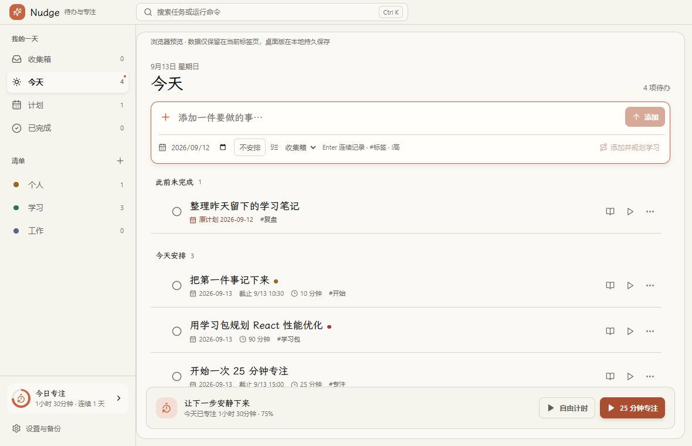
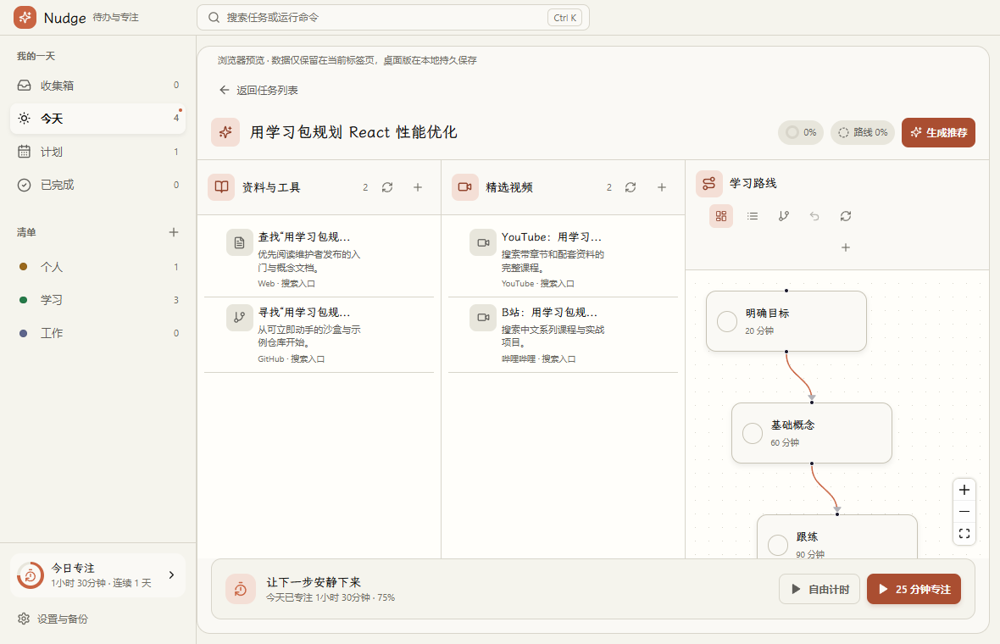
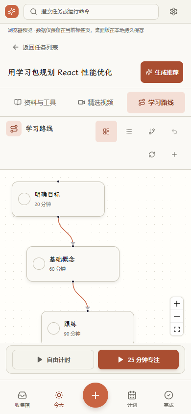
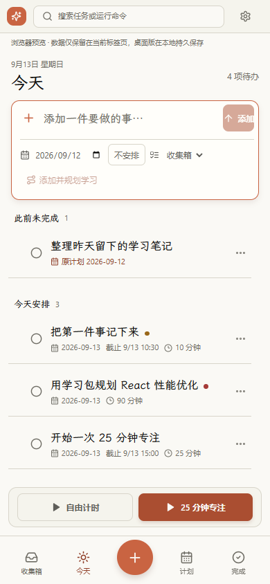
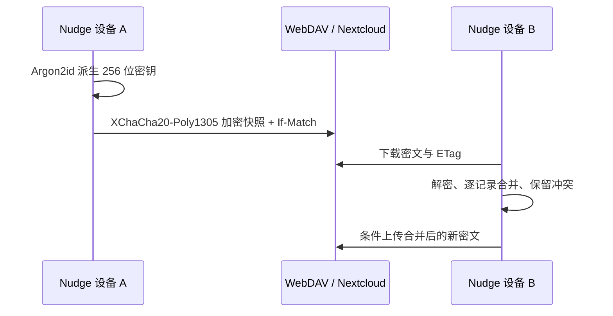
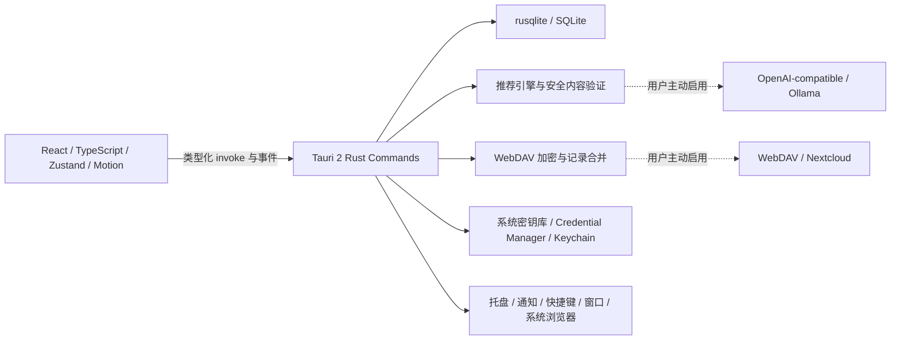

<p align="center">
  
</p>

<h1 align="center">Nudge</h1>

<p align="center">
  把待办、专注、学习资料与可编辑路线图放在一起的本地优先跨平台应用。
</p>

<p align="center">
  <a href="https://github.com/Kirtofu/study-nudge/actions/workflows/quality.yml"></a>
  <a href="https://github.com/Kirtofu/study-nudge/releases/tag/v2.2.0"></a>
  
</p>



Nudge 使用 Tauri 2、React、TypeScript、Rust 与 SQLite。写下一件事，按 Enter 保存并继续输入；此前安排但尚未完成的任务会留在“今天”。需要深入学习时，再从任务进入独立工作区，管理资料、视频和学习路线。应用默认不需要账号、不依赖云端，AI 推荐和 WebDAV 加密同步都由用户主动开启。

当前稳定版为 `v2.2.0`。这次重构重点是日常记录、可靠保存、可撤销操作及 Windows 使用体验。[更新记录](./docs/release-notes-v2.2.0.md) · [验证记录](./docs/validation-v2.2.0.md)。本文界面截图使用浏览器演示数据。

> [!IMPORTANT]
> `v2.2.0` 是当前稳定版本。桌面包暂未接入平台签名，Android 提供测试 APK，iOS 提供 Apple Silicon 模拟器 `.app.zip`。请从 [GitHub Release](https://github.com/Kirtofu/study-nudge/releases/tag/v2.2.0) 下载并核对 `SHA256SUMS.txt`。

## 下载 v2.2.0

所有 v2 二进制只发布到 [GitHub Release](https://github.com/Kirtofu/study-nudge/releases/tag/v2.2.0)，不提交到 Git 仓库。

| 平台 | 架构 | 发布物 | 下载 |
| --- | --- | --- | --- |
| Windows 10/11 | x64 | NSIS 安装版 | [Setup `.exe`](https://github.com/Kirtofu/study-nudge/releases/download/v2.2.0/Nudge-2.2.0-windows-x64-setup.exe) |
| Windows 10/11 | x64 | 便携 ZIP | [Portable `.zip`](https://github.com/Kirtofu/study-nudge/releases/download/v2.2.0/Nudge-2.2.0-windows-x64-portable.zip) |
| Ubuntu 22.04+ | x64 | AppImage / deb | [AppImage](https://github.com/Kirtofu/study-nudge/releases/download/v2.2.0/Nudge-2.2.0-linux-x64.AppImage) · [deb](https://github.com/Kirtofu/study-nudge/releases/download/v2.2.0/Nudge-2.2.0-linux-x64.deb) |
| Ubuntu 22.04+ | ARM64 | AppImage / deb | [AppImage](https://github.com/Kirtofu/study-nudge/releases/download/v2.2.0/Nudge-2.2.0-linux-arm64.AppImage) · [deb](https://github.com/Kirtofu/study-nudge/releases/download/v2.2.0/Nudge-2.2.0-linux-arm64.deb) |
| macOS 12+ | Intel | DMG / app ZIP | [DMG](https://github.com/Kirtofu/study-nudge/releases/download/v2.2.0/Nudge-2.2.0-macos-x64.dmg) · [app.zip](https://github.com/Kirtofu/study-nudge/releases/download/v2.2.0/Nudge-2.2.0-macos-x64.app.zip) |
| macOS 12+ | Apple Silicon | DMG / app ZIP | [DMG](https://github.com/Kirtofu/study-nudge/releases/download/v2.2.0/Nudge-2.2.0-macos-arm64.dmg) · [app.zip](https://github.com/Kirtofu/study-nudge/releases/download/v2.2.0/Nudge-2.2.0-macos-arm64.app.zip) |
| Android 10+ | ARM64 | 测试 APK | [APK](https://github.com/Kirtofu/study-nudge/releases/download/v2.2.0/Nudge-2.2.0-android-arm64-debug.apk) |
| iOS 16+ | Apple Silicon Simulator | 模拟器 app ZIP | [app.zip](https://github.com/Kirtofu/study-nudge/releases/download/v2.2.0/Nudge-2.2.0-ios-simulator-arm64.app.zip) |

[查看 SHA-256 校验文件](https://github.com/Kirtofu/study-nudge/releases/download/v2.2.0/SHA256SUMS.txt)

### 平台能力矩阵

| 能力 | Windows | macOS | Linux | Android | iOS |
| --- | :---: | :---: | :---: | :---: | :---: |
| 待办、清单、标签、提醒 | ✅ | ✅ | ✅ | ✅ | ✅ |
| 三栏学习包与路线图 | ✅ | ✅ | ✅ | ✅ | ✅ |
| 番茄钟、自由计时、异常恢复 | ✅ | ✅ | ✅ | ✅ | ✅ |
| AI 推荐、WebDAV 加密同步 | ✅ | ✅ | ✅ | ✅ | ✅ |
| 托盘、全局快捷键、开机启动 | ✅ | ✅ | ✅ | — | — |
| 置顶专注迷你窗 | ✅ | ✅ | ✅ | — | — |
| 平台签名 | 暂无 | 暂无 | 不适用 | 测试包 | 仅模拟器 |

## 学习包

普通记录是主操作，学习规划位于次级入口：

- **添加任务 / Enter**：立即保存并继续记录，支持中文输入法、日期、清单和防重复提交。
- **添加并规划学习**：先本地保存，再进入独立工作区。若打开失败，会明确提示任务已存在；重试只打开已有任务。

已有任务可以通过任务行、更多操作菜单或详情中的“打开学习工作区”进入。返回任务列表会恢复先前的滚动位置。

### 资料与工具

- 保存官方文档、参考资料、练习仓库、沙盒与本地备注。
- 支持新增、编辑、固定、删除和拖拽排序。
- 每栏默认最多 20 条，输入在 Rust 后端再次验证。
- 无 AI 时自动创建官方资料和练习工具搜索入口。

### 精选视频

- 支持 YouTube、B 站和其他 HTTPS 外链。
- YouTube 使用 oEmbed 获取标题和缩略图，B 站使用受限 OpenGraph 请求获取元信息。
- 无法验证的直链会降级为搜索卡片，不伪装成可信推荐。
- 视频统一交给系统浏览器或平台 App，不在 Nudge WebView 内播放。

### 可编辑学习路线

- 支持节点拖动、依赖连线、自动布局、缩放和列表视图。
- 新增连接前检测循环依赖，数据库层也会拒绝非法关系。
- 删除节点、移动节点、连接、断开、自动布局和状态切换均可撤销。
- 20 个节点以内优先图表视图；达到 50 个节点硬上限后默认使用可编辑列表视图。
- 默认五阶段模板：明确目标 → 基础概念 → 跟练 → 独立实践 → 复盘输出。

## 多端界面

学习工作区占据独立页面。可用内容宽度超过 54rem 时显示资料、视频、路线三栏；较窄窗口和平板、手机使用三个可键盘切换的标签页。路线默认保持可读字号，可平移查看后续步骤，也可点击“显示全图”查看概览。



<table>
  <tr>
    <td width="34%">
      
      <p align="center"><strong>手机标签页</strong><br>安全区、触摸目标与常驻学习包操作。</p>
    </td>
    <td width="33%">
      
      <p align="center"><strong>随手记录</strong><br>顶部搜索、日期选择与常驻专注操作。</p>
    </td>
    <td width="33%">
      
      <p align="center"><strong>加密同步设置</strong><br>凭据、同步状态与冲突入口。</p>
    </td>
  </tr>
</table>

## 默认离线，可选 AI

创建任务和打开学习工作区都不自动调用 AI。点击“生成推荐”“重新规划”或单栏重试后，才会根据配置生成内容；联网生成仍需要确认发送范围。

| 方式 | 网络 | 凭据 | 说明 |
| --- | --- | --- | --- |
| 离线模板 | 不需要 | 不需要 | 即时创建资料、视频搜索入口与五阶段路线 |
| OpenAI-compatible | 用户端点 | API Key | 自定义 HTTPS 端点与模型 |
| Ollama | 本机 | 通常不需要 | 允许本机 `http://localhost` 模型服务 |

首次联网生成前会明确展示将发送的数据。默认只发送任务标题、标签和用户主动填写的学习目标；任务备注必须单独授权。不会发送其他任务、数据库、专注历史、AI 密钥、WebDAV 凭据或同步口令。

- API Key、WebDAV 密码和可选同步口令由 Rust 保存到 Windows Credential Manager、macOS/iOS Keychain、Android Keystore 或 Linux Secret Service；不写入 SQLite、日志、JSON 备份或同步快照。
- 系统密钥库不可用时只允许本次会话使用，不会静默写入明文文件。旧版 `nudge-vault.hold` 仅在新密钥库写入并回读验证成功后删除。
- 三栏独立生成，一栏失败不会清空其他两栏；支持取消、单栏重试和保留固定内容。
- 输出必须通过结构化 JSON 校验、数量限制、文本清洗与 URL 安全检查。
- 远程链接只允许 HTTPS；Ollama 仅对本机 HTTP 例外。

## WebDAV / Nextcloud 端到端加密同步

同步完全可选，不需要 Nudge 账号或自有云后端。配置时需要 WebDAV 地址、用户名、密码和一个独立同步口令。



- WebDAV 服务器只看到版本、盐、随机数和密文。
- WebDAV 凭据与记住的同步口令保存在系统密钥库，不进入导出或跨设备同步。
- `v2.2` 沿用 `v2.1` 的 schema 3 和加密信封 v2，已使用 v2.1 的设备不需要再升级格式；v2.0 设备需要先升级应用。
- 每条同步记录包含混合逻辑时钟、设备 ID、修订号和删除墓碑。
- 使用 ETag 条件写入；遇到 `412 Precondition Failed` 会重新下载、合并并重试。
- 断网修改进入持久队列；并发冲突保存在“同步冲突”中，可选择本地或远端版本恢复。

## 待办与专注能力

### 待办

- 收集箱、今天、计划、已完成和自定义清单。
- 行内快速添加，支持 `#标签`、`!高`、`!中`、`!低` 快速语法。
- 标签、优先级、计划日期、截止提醒、预计时长、备注和子任务。
- 统一搜索全部任务的标题、备注与标签，已完成结果带明确标记；Ctrl+K / Ctrl+F 打开，方向键与 Enter 选择。
- “此前未完成”保留原计划日期，跨午夜或电脑唤醒后自动刷新“今天”。
- 拖拽只改变当前分组的次序，编辑或重启后仍保留排序。
- 完成和删除均提供独立的 5 秒撤销；失败操作可以重试。

### 专注

- 可配置时长的番茄钟与自由正计时，可关联任务；所有入口显示实际配置时长。
- 暂停、继续、跳过、停止、今日目标、长期目标、连续天数和历史记录。
- 基于时间戳恢复，正确处理休眠、唤醒和异常退出。
- 重复启动同一任务保留当前计时；切换前选择“保存并切换”或“继续当前专注”，上一段历史和新计时状态原子保存。
- 桌面端支持置顶迷你窗、托盘、原生通知、开机启动和全局快速添加。
- 移动端使用系统通知与安全区底部导航，不提供常驻迷你窗。

### v2.2 保存与性能改进

- 启动通过一次 `app.bootstrap()` 载入任务、清单、标签、设置、专注状态、推荐配置与同步摘要。
- 新建、编辑、完成、删除与排序统一消费变更集；按任务串行写入，失败只回滚对应操作。
- 详情自动保存按任务串行，合并尚未发送的字段，过期响应不会覆盖新草稿。
- 明确显示保存中、保存失败和重试；同步、导入及另一窗口的变更会刷新相关数据，保留正在编辑的字段。
- 设置按“通用、AI、同步、数据”分栏；切换标签不会丢失未提交内容。
- 专注历史支持 7 天、30 天和全部范围，并按日期显示时长、模式与关联任务。
- 首屏按需加载学习包、设置、命令面板和专注历史；CI 限制首屏 JS、CSS 与字体体积。

## 数据、备份与 v1 迁移

渲染层不能直接访问文件系统或数据库。所有读写通过类型化 Tauri 命令进入 Rust，输入在边界统一验证。

| 平台 | 默认应用数据目录 |
| --- | --- |
| Windows | `%APPDATA%\io.github.kirtofu.nudge\` |
| macOS | `~/Library/Application Support/io.github.kirtofu.nudge/` |
| Linux | `$XDG_DATA_HOME/io.github.kirtofu.nudge/` 或 `~/.local/share/io.github.kirtofu.nudge/` |
| Android / iOS | 系统分配的应用私有数据目录 |

主数据库为该目录下的 `nudge.db`，自动数据库备份位于相邻 `backups/`，保留最近 7 份。

### 从 Windows v1 迁移

首次启动 v2 时会检测 `%APPDATA%\Nudge\nudge.db`：

1. 使用 SQLite Backup API 复制到 v2 应用目录。
2. 在副本上执行 SQLite schema 迁移，并在迁移前创建备份。
3. 为旧任务初始化空学习包。
4. 保留原数据库和原有最近 7 份备份，不修改、不删除。

JSON 备份当前为 `schemaVersion: 3`，仍接受 v1/v2 备份并为旧任务初始化空学习包。旧 `data.json` 继续按内容哈希幂等导入专注记录；仓库中的 `study-nudge.ps1` 和 `data.json` 保持原样，脚本后续写入的记录会在应用启动时继续同步导入。

支持 JSON 导出、合并导入、覆盖恢复、恢复前自动备份以及每日备份轮换。

## 技术架构



主要技术：

- Tauri 2 + Rust 2024。
- React 19 + TypeScript 5 + Vite 7。
- `rusqlite` + SQLite Backup API。
- Zustand 状态管理、Motion 动效、dnd-kit 拖拽。
- `@xyflow/react` 路线图；自动布局由 Rust 单次命令完成。
- Argon2id + XChaCha20-Poly1305 加密同步。
- Rust 系统密钥库保存 AI / WebDAV 秘密；旧 vault 仅用于一次性迁移。
- Vitest + Testing Library + Rust 单元测试。

### 类型化公共接口

渲染层通过统一桥接调用以下 API 族：

- `app.bootstrap()` 返回 `BootstrapSnapshot`，任务写入返回 `TaskMutationResult` / `EntityChangeSet`，排序返回 `TaskOrderPatch`。
- `app.onDataChanged(callback)` 提供受影响的数据域及 `local` / `import` / `sync` 来源；仅刷新相关窗口数据。
- `tasks`、`lists`、`tags`、`focus`、`settings`、`backup`、`desktop`。
- `focus.history(query)` 返回分页专注历史。
- `learning.get / ensure / generate / cancel`。
- `learning.resources.create / update / delete / reorder / pin`。
- `learning.roadmap.upsertNode / deleteNode / connect / disconnect / autoLayout / setStatus`。
- `recommendation.testConnection / updateSettings`。
- `sync.configure / test / run / disconnect / getState / listConflicts / resolveConflict`。
- `learning.onProgress` 与 `sync.onStateChanged` 事件流。

SQLite schema 3 新增 `learning_packs`、`learning_resources`、`learning_nodes`、`learning_edges`、`sync_conflicts`、同步队列与修订元数据，并为任务标签关联增加版本向量和墓碑字段。AI 密钥和 WebDAV 秘密不在这些表中。

## 本地开发

### 通用要求

- Node.js 22 LTS、npm 10+。
- Rust 1.88+，包含 `rustfmt` 与 `clippy`。
- Git；只有维护 v1 历史软件包时才需要 Git LFS。

```bash
git clone https://github.com/Kirtofu/study-nudge.git
cd study-nudge
npm ci
npm run dev
```

### Web 与质量检查

```bash
npm run dev:web
npm run typecheck
npm test -- --run
npm run test:e2e
npm run build:web
npm run check:bundle
cargo fmt --manifest-path src-tauri/Cargo.toml -- --check
cargo clippy --manifest-path src-tauri/Cargo.toml --all-targets --all-features -- -D warnings
cargo test --manifest-path src-tauri/Cargo.toml
```

### Windows

需要 Visual Studio 2022 Build Tools（Desktop development with C++）、Windows SDK 与 WebView2 Runtime。

```powershell
. .\scripts\prepare-windows-deps.ps1
npm run dev
npm run build:win
```

`build:win` 自动从 libsodium 官方 HTTPS 地址缓存安装包及 `.minisig`，并设置 `SODIUM_DIST_DIR`；依赖自身的签名验证保持启用。手动执行 Cargo 时需在同一个 PowerShell 会话先加载上述脚本。

构建或安装后可运行原生冒烟测试（先退出其他 Nudge 进程）：

```powershell
node scripts/smoke-windows.cjs "D:\你的安装目录\nudge.exe"
```

测试使用 `src-tauri/target/` 下的临时数据库、独立 WebView2 目录和仅内存测试凭据，并启动本机 WebDAV 测试服务；不会读取正式数据库或系统密钥库。浏览器演示只在当前标签页保留数据，备份、真实联网 AI 与同步请使用桌面应用。

### Linux

Ubuntu / Debian 构建依赖：

```bash
sudo apt update
sudo apt install -y libwebkit2gtk-4.1-dev libayatana-appindicator3-dev librsvg2-dev patchelf build-essential
npm run dev
npx tauri build --bundles appimage,deb
```

### macOS

需要 macOS 12+、Xcode Command Line Tools；构建 iOS 还需要完整 Xcode 与可用模拟器。

```bash
npm run dev
npx tauri build --bundles app,dmg
```

### Android

需要 JDK 17、Android SDK 35、NDK `27.1.12297006` 与对应 Rust 目标。

```bash
rustup target add aarch64-linux-android
npm run android:init
npm run android:build
```

Windows 主机可使用仓库脚本：

```powershell
npm run android:build:windows
```

### iOS Simulator

只支持 macOS 构建：

```bash
rustup target add aarch64-apple-ios-sim
npm run ios:init
npx tauri ios build --target aarch64-sim --debug --ci
```

正式 IPA、真机签名和 App Store 发布需要后续接入 Apple 开发者证书。

## CI 与发布

`.github/workflows/quality.yml` 在 push / pull request 上运行类型检查、React/Vitest、Vite 生产构建、体积预算、npm/Rust 依赖审计以及 Rust fmt、clippy、test。

`.github/workflows/release.yml` 在版本 tag 上构建：

- Windows x64 NSIS 与便携 ZIP。
- Linux x64 / ARM64 AppImage 与 deb。
- macOS Intel / Apple Silicon DMG 与 `.app.zip`。
- Android ARM64 测试 APK。
- iOS Apple Silicon Simulator `.app.zip`。
- 汇总 SHA-256，并创建正式 GitHub Release。

## 项目结构

```text
study-nudge/
├─ .github/workflows/       # 质量检查与跨平台发布
├─ docs/screenshots/        # README 应用截图
├─ scripts/                 # 依赖缓存、平台构建与 Windows 原生验证
├─ src/
│  ├─ renderer/src/         # features/ 业务界面、state/ 状态、bridge/ 原生与演示适配
│  └─ shared/               # 前后端共享 TypeScript 类型
├─ src-tauri/
│  ├─ capabilities/         # 桌面 / 移动权限边界
│  ├─ gen/android/          # Tauri Android 工程
│  ├─ icons/                # 全平台应用图标
│  └─ src/                  # commands/ 与 database/ 按任务、专注、学习、设置与同步拆分
├─ DESIGN.md                # 界面设计系统
├─ PRODUCT.md               # 产品定位与设计原则
├─ study-nudge.ps1          # 保留的 v1 学习记录脚本
└─ data.json                # 保留的 v1 专注数据
```

## v1.0.0 保留下载

v1 Release、tag 与原 Git LFS 软件包不会被 v2 覆盖或删除：

| v1 Windows x64 | 下载 | SHA-256 |
| --- | --- | --- |
| 安装版 | [Nudge-Setup-1.0.0-x64.exe](https://github.com/Kirtofu/study-nudge/releases/download/v1.0.0/Nudge-Setup-1.0.0-x64.exe) | `83A14479CC696AE79E4F3C84965773387B55EF112B218F85C0D636D715608107` |
| 便携版 | [Nudge-Portable-1.0.0-x64.exe](https://github.com/Kirtofu/study-nudge/releases/download/v1.0.0/Nudge-Portable-1.0.0-x64.exe) | `01DE4F444F54272663891B09ECBAB64D6D3F4D0B0F137915A03F1997784A2D` |

历史包仍可在仓库 [`packages/`](./packages/) 中通过 Git LFS 获取。

## 当前限制

- Windows 和 macOS 安装包尚未接入 Authenticode / Developer ID 签名。
- Android 当前为测试 APK，iOS 当前为模拟器包，不能直接安装到真机。
- 不包含账号系统、自有云后端、实时协作、重复任务、看板、月历或自动更新。
- 不自动为每个任务消耗 AI，不嵌入第三方视频播放器，不同步任何秘密信息。

## 许可证

MIT
